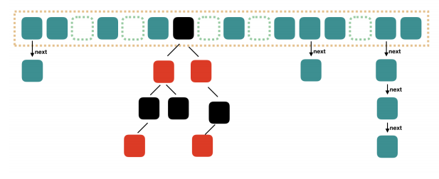
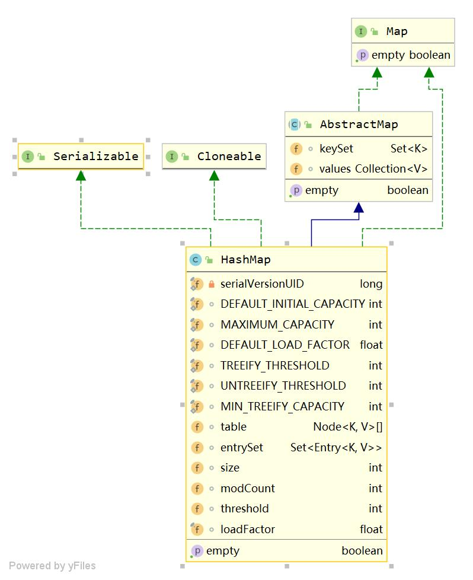

# HashMap

## 概述
### 数据结构
数组+链表+红黑树
 
### 类图
 


## QA

### 何时变红黑树
```java
    /**
     * The bin count threshold for using a tree rather than list for a
     * bin.  Bins are converted to trees when adding an element to a
     * bin with at least this many nodes. The value must be greater
     * than 2 and should be at least 8 to mesh with assumptions in
     * tree removal about conversion back to plain bins upon
     * shrinkage.
     */
    static final int TREEIFY_THRESHOLD = 8;

    /**
     * The bin count threshold for untreeifying a (split) bin during a
     * resize operation. Should be less than TREEIFY_THRESHOLD, and at
     * most 6 to mesh with shrinkage detection under removal.
     */
    static final int UNTREEIFY_THRESHOLD = 6;
```

### 何时扩容

负载因子的定义公式：`threshold = table.length * loadFactor`

结合负载因子的定义公式可知，threshold就是在此Load factor和length(数组长度)对应下允许的最大元素数目，超过这个数目就重新resize(扩容)，
扩容后的HashMap容量是之前容量的两倍。默认的负载因子0.75是对空间和时间效率的一个平衡选择，建议大家不要修改，除非在时间和空间比较特殊的情况下，
如果内存空间很多而又对时间效率要求很高，可以降低负载因子Load factor的值；相反，如果内存空间紧张而对时间效率要求不高，可以增加负载因子loadFactor的值，这个值可以大于1。


### put方法流程
 

### 为何table的长度length为2的n次方
常规的设计是把桶的大小设计为素数，相对来说素数导致冲突的概率要小于合数。
HashMap采用这种非常规设计，主要是为了在**取模**和**扩容**时做优化。

- 取模：位运算代替取模运算。
- 扩容：下标不变，或者+oldCapacity

扩展：
[使用位运算(&)代替取模运算(%)](https://www.jianshu.com/p/439b3236717d)