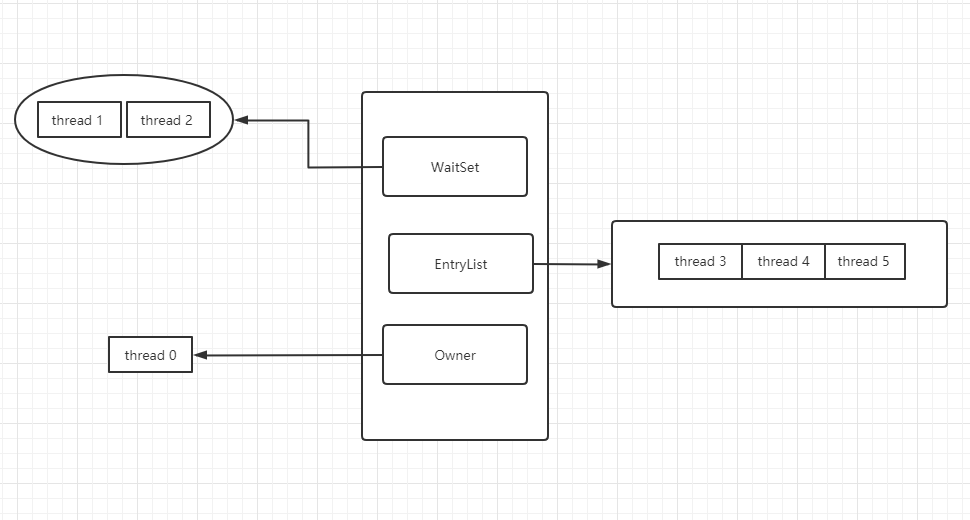
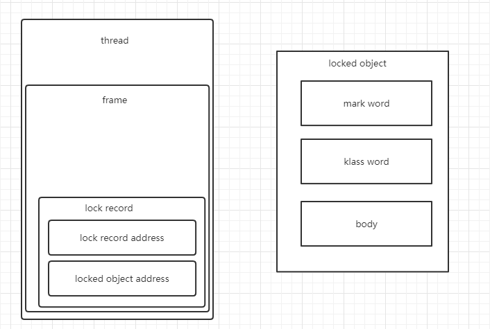
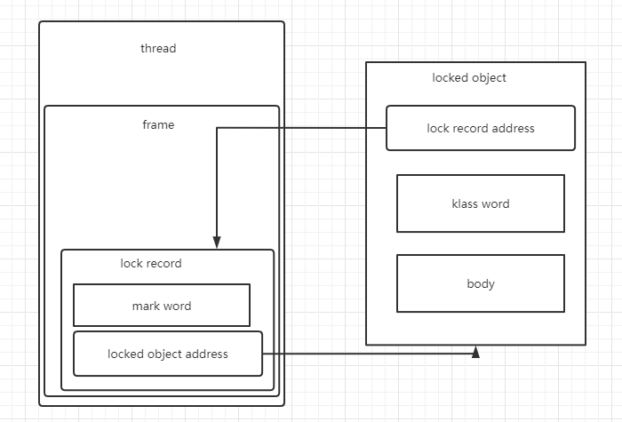
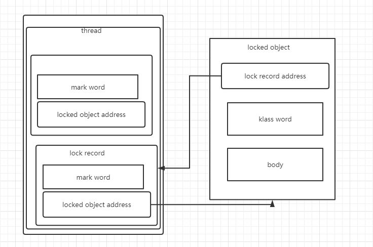
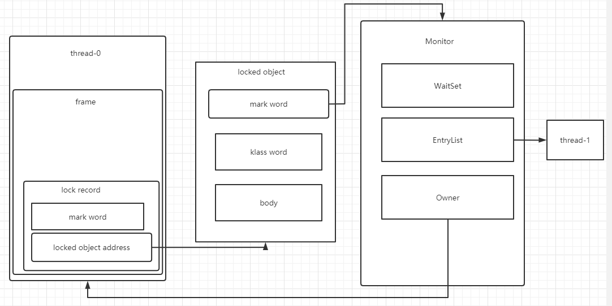

# Synchronized

## Monitor结构图



## Java 对象头（32位）

```
普通对象
|--------------------------------------------------------------|
| Object Header (64 bits)                                      |
|------------------------------------|-------------------------|
| Mark Word (32 bits)                |    Klass Word (32 bits) |
|------------------------------------|-------------------------|


数组对象
|---------------------------------------------------------------------------------|
|                   Object Header (96 bits)                                       |
|--------------------------------|-----------------------|------------------------|
| Mark Word(32bits)              | Klass Word(32bits)    | array length(32bits)   |
|--------------------------------|-----------------------|------------------------|


Mark Word 结构
|-------------------------------------------------------|--------------------|
| Mark Word (32 bits)                                   | State              |
|-------------------------------------------------------|--------------------|
| hashcode:25 | age:4 | biased_lock:0 | 01              | Normal             |
|-------------------------------------------------------|--------------------|
| thread:23 | epoch:2 | age:4 | biased_lock:1 | 01      | Biased             |
|-------------------------------------------------------|--------------------|
| ptr_to_lock_record:30 | 00                            | Lightweight Locked |
|-------------------------------------------------------|--------------------|
| ptr_to_heavyweight_monitor:30 | 10                    | Heavyweight Locked |
|-------------------------------------------------------|--------------------|
|                          | 11                         | Marked for GC      |
|-------------------------------------------------------|--------------------|


```

## 轻量级锁

无竞争时，使用轻量级锁

创建lock record：


cas 交换 lock record address 与 mark word：


若cas失败：

- 如果是其它线程已经持有了该 Object 的轻量级锁，这时表明有竞争，进入**锁膨胀**
- 如果是自己执行了 synchronized 锁重入，那么再添加一条 Lock Record 作为重入的计数


退出 synchronized 代码块（解锁时）锁记录的值不为 null，这时使用 cas 将 Mark Word 的值恢复给对象头
- 成功，则解锁成功
- 失败，轻量级锁进行了锁膨胀或已经升级为重量级锁，进入重量级锁解锁流程

## 锁膨胀
为 Object 对象申请 Monitor 锁，让Object 指向重量级锁地址，然后自己进入 Monitor的EntryList



## 自旋优化
重量级锁竞争的时候，可以使用自旋来进行优化

## 偏向锁
作用：减少cas，进一步提高性能

触发条件：第一次使用 CAS 将线程 ID 设置到对象的Mark Word头


