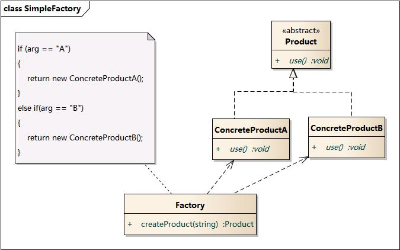
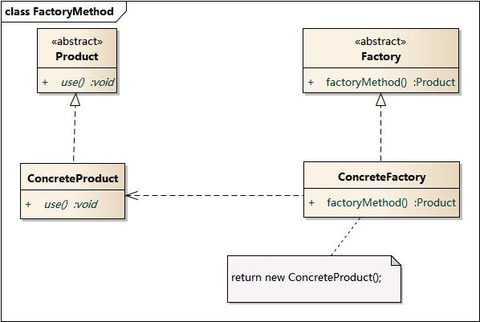
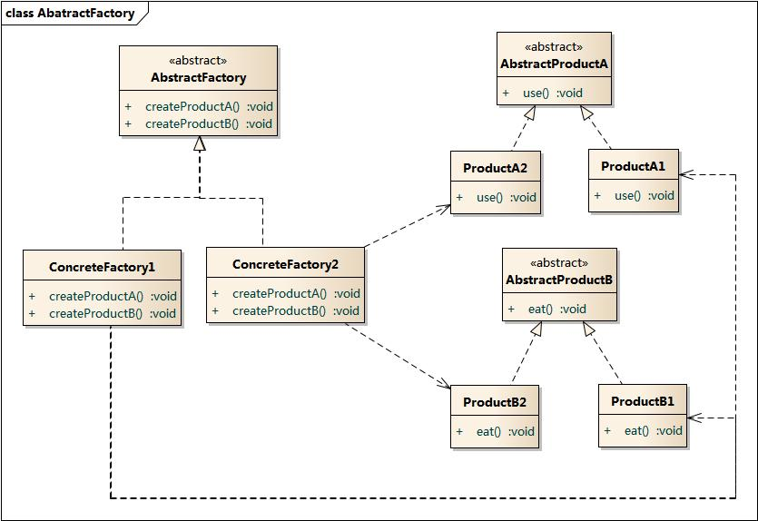

# Factory

## 简单工厂模式

### 优点

- 实现了对责任的分割，它提供了专门的工厂类用于创建对象。
- 客户端无须知道所创建的具体产品类的类名，只需要知道具体产品类所对应的参数即可，对于一些复杂的类名，可以减少使用者的记忆量可以减少使用者的记忆量。

### 缺点

- 违反开闭原则
- 违反单一职责

##  工厂方法模式

### 优点

- 符合开闭原则
- 符合单一职责

### 缺点

- 复杂一点

##  抽象工厂模式

### 优点

- 一个工厂负责创建多种类型的对象

### 缺点

- 复杂一点

## 总结

- 封装变化：创建逻辑有可能变化，封装成工厂类之后，创建逻辑的变更对调用者透明。
- 代码复用：创建代码抽离到独立的工厂类之后可以复用。
- 隔离复杂性：封装复杂的创建逻辑，调用者无需了解如何创建对象。
- 控制复杂度：将创建代码抽离出来，让原本的函数或类职责更单一，代码更简洁
