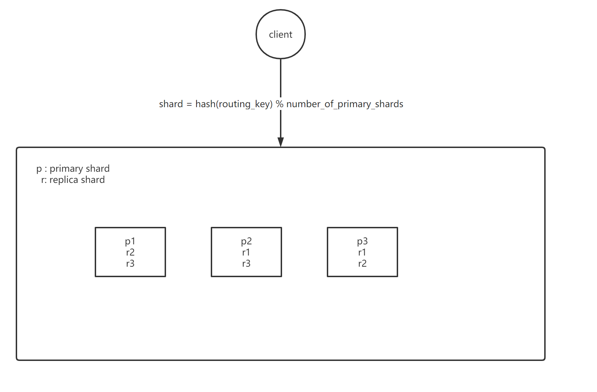

#Elasticsearch

## 主要价值
- 全文检索

## docker-compose快速上手
```yaml
version: '3.3'
services:
  elasticsearch:
    image: elasticsearch:7.8.0
    container_name: elasticsearch
    restart: always
    ports:
      - 9200:9200
    environment:
      discovery.type: single-node
      TZ: Asia/Shanghai
    #volumes:
    #   - ./elasticsearch/logs:/usr/share/elasticsearch/logs
    #   - ./elasticsearch/data:/usr/share/elasticsearch/data
    #   - ./elasticsearch/config/elasticsearch.yml:/usr/share/elasticsearch/config/elasticsearch.yml
    ulimits:
      memlock:
        soft: -1
        hard: -1
```

## Elasticsearch架构



## 写一致性
- one模式，就是对于document的写操作（增删改），只要有一个primary shard是active活跃可用的，操作就可以执行。
- all模式，就是对于document的写操作（增删改），要求必须所有的primary shard和replica shard都是活跃的，才可以执行这个写操作。
- quorum模式，就是对于document的写操作（增删改），写之前必须确保大多数（**(primary + number_of_replicas) / 2 + 1**）shard都可用，当不满足“大多数”这个条件时，可设置timeout。

## 路由
### 写
通过 hash(document_id)%num_of_primary_shards决定写到特定shard。
client可能请求至随机primary shard，该shard为coordinate shard，代理请求。
### 读
与写类似，不过replica shard可提供读能力。
## 并发
Elasticsearch内部采用了版本号机制对document的并发修改进行控制 。所谓版本号，本质是一种乐观锁。


## 倒排索引
假设我们向某个索引里写入了下面两条document：

- The quick brown fox jumped over the lazy dog
- Quick brown foxes leap over lazy dogs in summer


| Term        | Doc_1   |  Doc_2  |
| --------   | -----:  | :----:  |
| Quick     |  |   X     |
| The        |   X   |      |
| brown        |    X    |  X  |

现在，如果我们想搜索 quick brown ，我们只需要查找包含每个词条的文档：

| Term        | Doc_1   |  Doc_2  |
| --------   | -----:  | :----:  |
| Quick     |  |   X     |
| brown        |    X    |  X  |
| Total        |    2    |  1  |

两个文档都匹配，但是第一个文档比第二个匹配度更高。如果我们使用仅计算匹配词条数量的简单 相似性算法 ，那么，我们可以说，对于我们查询的相关性来讲，第一个文档比第二个文档更佳。


