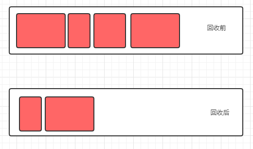
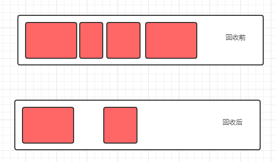
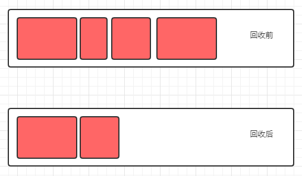
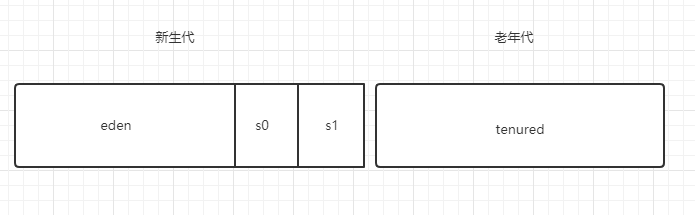
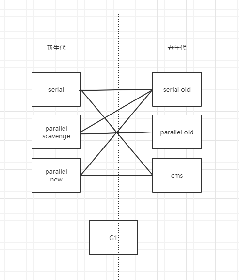

# GC

## 理论

### 垃圾定位

可达性算法

#### GC ROOT
- 虚拟机栈（栈帧中的本地变量表）中引用的对象
- 方法区中类静态属性引用的对象
- 方法区中常量引用的对象
- 本地方法栈中 JNI（即一般说的 Native 方法）引用的对象

### 回收算法

#### 复制（Copy）

- 优点：无内存碎片
- 缺点：速度堪忧；浪费内存
#### 标记清除（Mark Sweep）

- 优点：速度快
- 缺点：内存碎片
#### 标记整理（Mark Compact）

- 优点：无内存碎片
- 缺点：速度慢

#### 分代收集算法

综合`复制`、`标记清除`、`标记整理`算法各自优点，根据对象**生命周期**特点采用不同算法。

**新生代:**

Eden:S0:S1 默认 **8:1:1**，采用`复制`算法。

当新生代将满时，触发 **Minor GC**，只有很少对象存活，复制到s1,对象年龄+1， 交换s0、s1。

**对象何时晋升老年代？**

- 当对象的年龄达到了我们设定的阈值（默认15），则会从S0（或S1）晋升到老年代
- 大对象，当某个对象分配需要大量的连续内存时，会直接分配在老年代，减少minor gc开销。
- 在 S0（或S1） 区相同年龄的对象大小之和大于 S0（或S1）空间一半以上时，则年龄大于等于该年龄的对象也会晋升到老年代。

## 实现

- 新生代：Serial, ParNew, ParallelScavenge
- 老年代：CMS，Serial Old, Parallel Old
- 新老生代：G1

### Serial
单线程，client模式使用。
### ParNew
多线程，与 Serial 共用一套代码。
### ParallelScavenge
多线程。
提供了参数来精确控制吞吐量：

- 控制最大垃圾收集时间的 -XX:MaxGCPauseMillis
- 设置吞吐量大小的 -XX:GCTimeRatio（默认99%）
- 自适应策略：XX:UseAdaptiveSizePolicy，开启这个参数后，就不需要手工指定新生代大小,Eden 与 Survivor 比例（SurvivorRatio）等细节，只需要设置好基本的堆大小（-Xmx 设置最大堆）,以及最大垃圾收集时间与吞吐量大小，虚拟机就会根据当前系统运行情况收集监控信息，动态调整这些参数以尽可能地达到我们设定的最大垃圾收集时间或吞吐量大小这两个指标。

### Serial Old
单线程，client模式使用。
### Parallel Old
多线程，标记整理, 相对于 Parallel Scavenge 收集器的老年代版本，他们都是为了**吞吐量优先**。

### CMS
多线程，以实现**最短 STW 时间**为目标的收集器

###  G1（Garbage First）

//todo