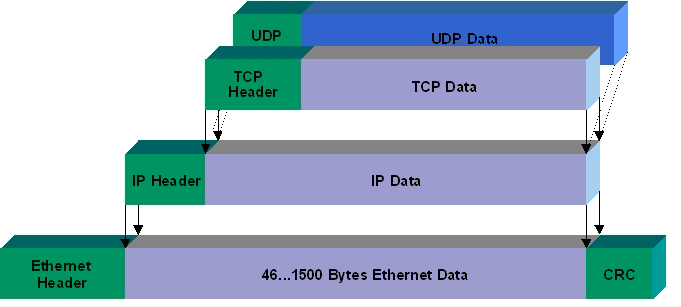
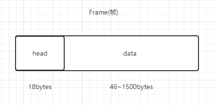
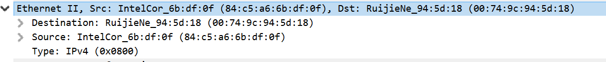
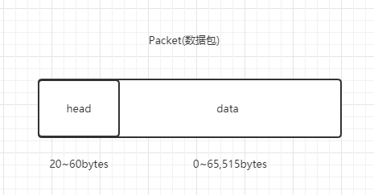
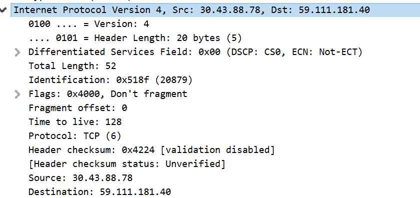
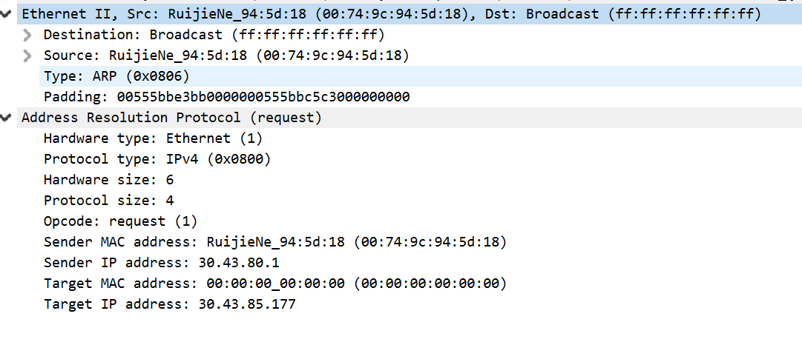

# Architecture
<!--osi七层模型-->

<!---->

<!--tcp/ip四层模型-->

## 数据链路层

### 以太网协议

数据结构图：

MTU:1500

头字段：

通过mac地址通信，对方mac地址通过 arp 协议获取:

- 当源ip跟目的ip在同一个子网，可通过**ARP**获取mac
- 当不在同一子网，直接发给**网关**

## 网络层

### IPv4协议

数据结构图：

头字段：

### ARP协议

## 传输层

### TCP
可靠，面向连接

### UDP
不可靠