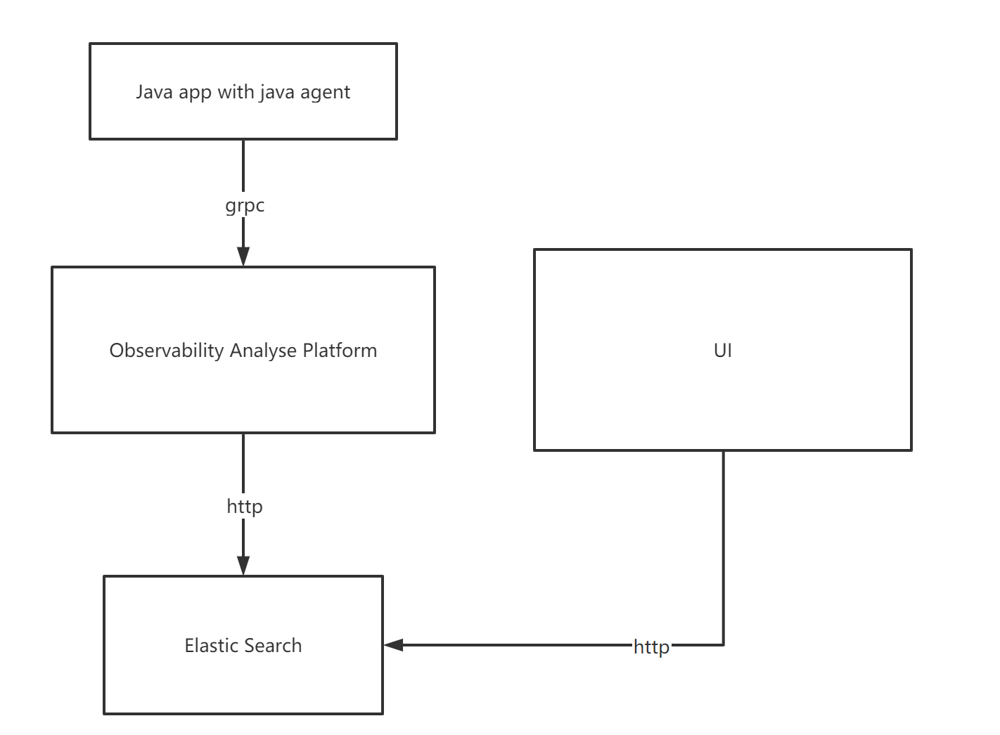

# Skywalking

## 主要价值

- 服务间调用链路追踪
- 应用性能检测


## 快速使用
### docker-compose简单部署
```yaml

version: '3.3'
services:
  elasticsearch:
    image: elasticsearch:7.8.0
    container_name: elasticsearch
    restart: always
    ports:
      - 9200:9200
    environment:
      discovery.type: single-node
      TZ: Asia/Shanghai
    #volumes:
    #   - ./elasticsearch/logs:/usr/share/elasticsearch/logs
    #   - ./elasticsearch/data:/usr/share/elasticsearch/data
    #   - ./elasticsearch/config/elasticsearch.yml:/usr/share/elasticsearch/config/elasticsearch.yml
    ulimits:
      memlock:
        soft: -1
        hard: -1
  oap:
    image: apache/skywalking-oap-server:8.0.1-es7
    container_name: oap
    depends_on:
      - elasticsearch
    links:
      - elasticsearch
    restart: always
    ports:
      - 11800:11800
      - 12800:12800
    environment:
      SW_STORAGE: elasticsearch7  # 指定ES版本
      SW_STORAGE_ES_CLUSTER_NODES: elasticsearch:9200
      TZ: Asia/Shanghai
    # volumes:
    #  - ./config/alarm-settings.yml:/skywalking/config/alarm-settings.yml
  ui:
    image: apache/skywalking-ui:8.0.1
    container_name: ui
    depends_on:
      - oap
    links:
      - oap
    restart: always
    ports:
      - 8080:8080
    environment:
      SW_OAP_ADDRESS: oap:12800
      TZ: Asia/Shanghai

```
### IDEA接入使用
- 下载os对应skywalking agent，https://skywalking.apache.org/downloads/
- vm参数配置`-Dskywalking.agent.service_name=[SVC_NAME] -Dskywalking.collector.backend_service=[host:port] -javaagent:/path of your agent/skywalking-agent.jar`

## 经典架构


