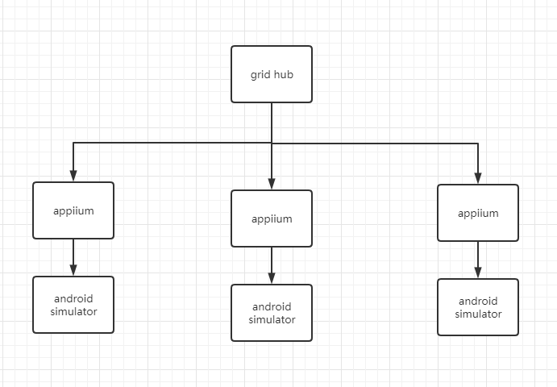

# Distributed App Crawler

## 架构图



## 背景
某潮鞋app定时抢购，核心抢购逻辑使用私有网络协议，分析成本过高。为简化方案，采用appium分布式模拟人工抢购。

## 需求
- 半小时内预约2w账号

## 方案
### 账号来源及免登
- 手机接码
- 登录后，保存app状态持久化相关文件
- 下次登录直接替换相关文件
### 身份证来源
- [身份证生成器](https://www.googlespeed.cn/idcard/?year=1920&month=09&day=08&sex=%E7%94%B7&province=12&city=1201&county=120102)，不侵犯隐私

### 代理
- tcp代理

### 分布式调度模型

```sql

```
